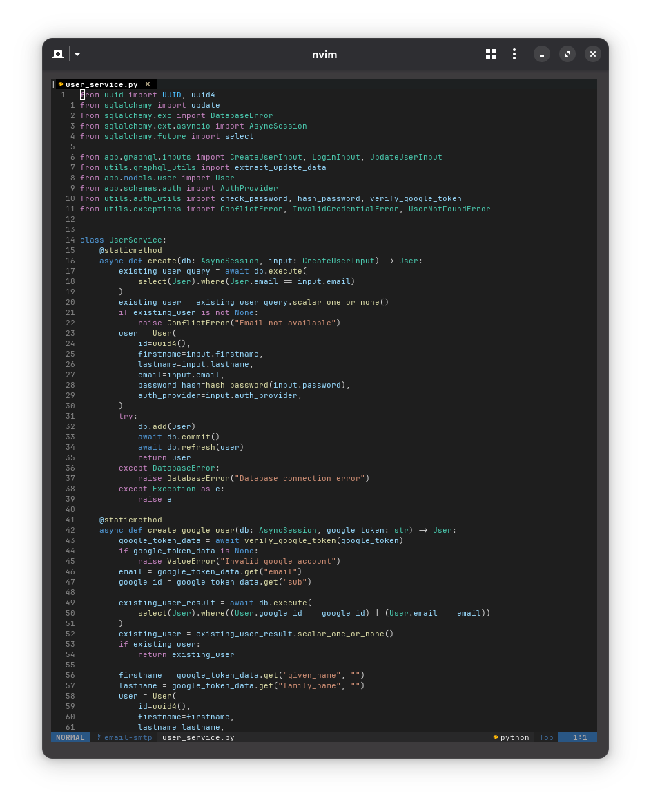
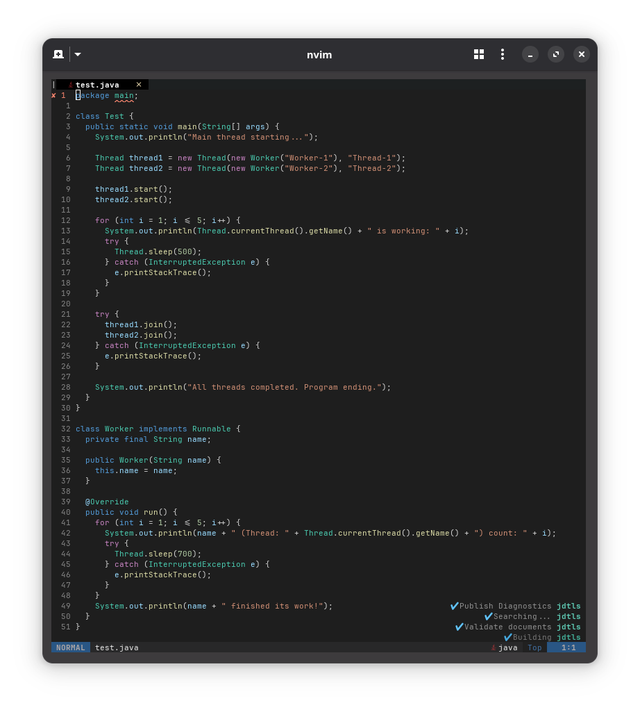

# darkplus.nvim

An exact replica of VS Code's Dark+ theme for Neovim with full Treesitter and LSP support.

## Screenshots




## Installation

### lazy.nvim
```lua
return {
  "victorchiaka/darkplus.nvim",
  version = "*", -- Optional: use latest stable release
  lazy = false,
  priority = 1000,
  config = function()
    vim.cmd("colorscheme darkplus")
  end,
}
```

### packer.nvim
```lua
use {
  "victorchiaka/darkplus.nvim",
  tag = "*", -- Optional: use latest stable release
  config = function()
    vim.cmd("colorscheme darkplus")
  end
}
```

## Features

- Precise VS Code Dark+ color matching
- Full Treesitter and LSP support
- Language-specific keyword highlighting
- Plugin support (Telescope, NvimTree, GitSigns, etc.)

## Contributing

Contributions welcome! Open an issue or pull request for:
- Bug reports and fixes
- Language support improvements
- Plugin compatibility
- Documentation
